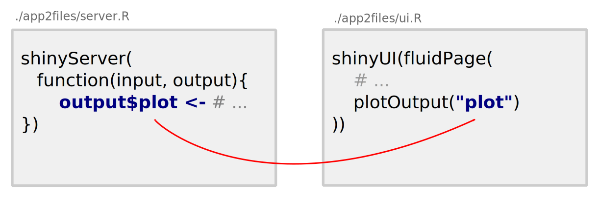
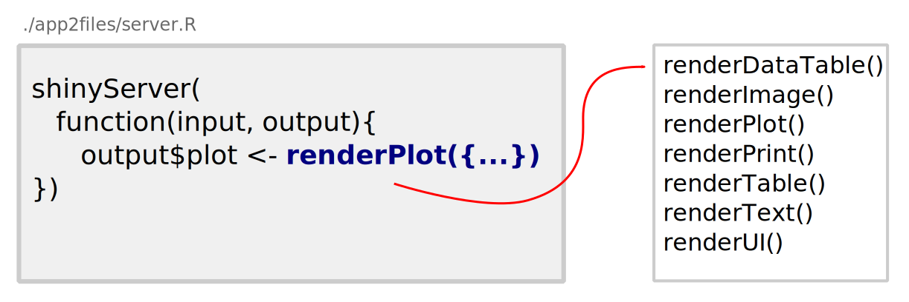
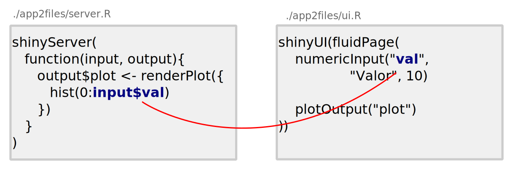
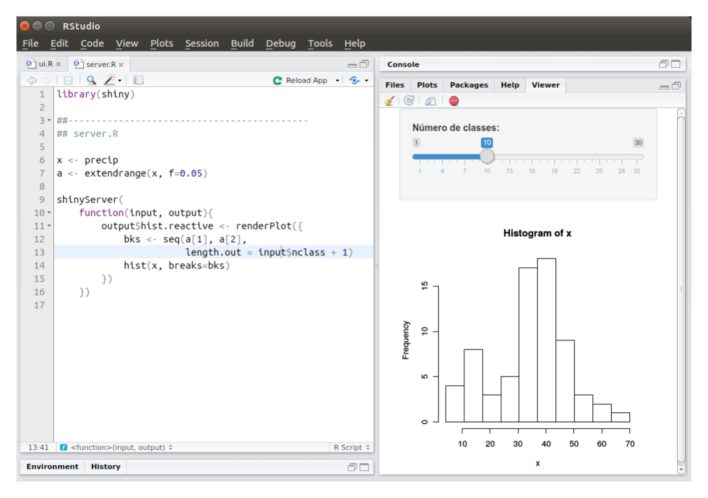
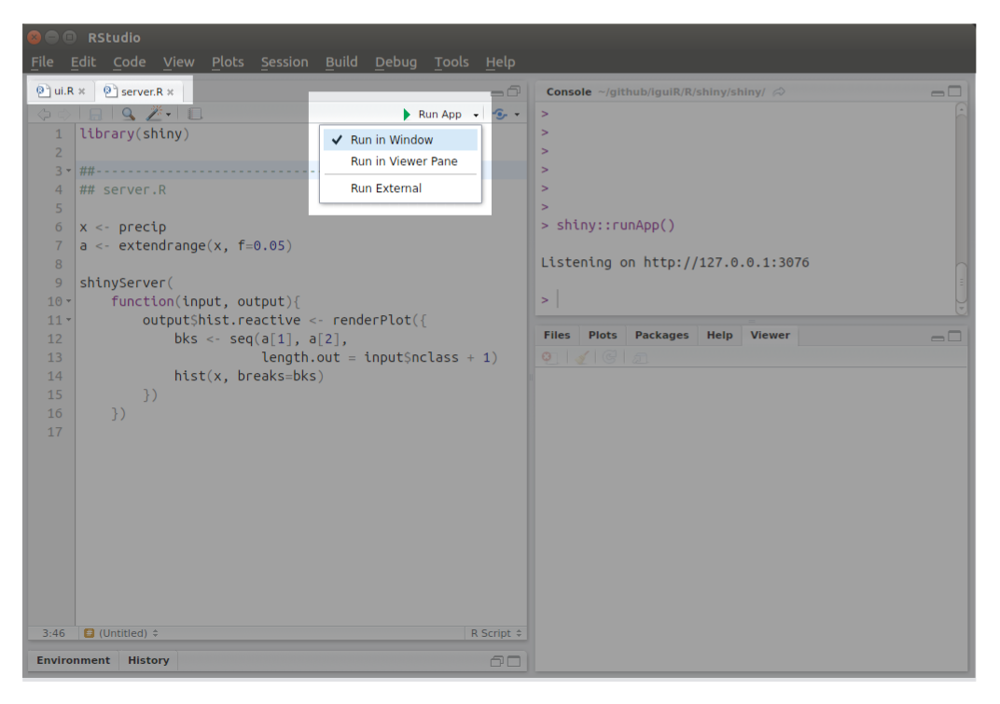

---
output:
  revealjs::revealjs_presentation:
    css: css/style.css
    theme: serif
    transition: slide
    center: false
    smart: false
    highlight: monochrome
    incremental: false
    self_contained: false
    reveal_plugins:
      - zoom
      - menu
    reveal_options:
      slideNumber: true
      progress: true
---

```{r setup, include=FALSE}

library(knitr)
opts_chunk$set(
    warning = FALSE,
    message = FALSE,
    echo = TRUE,
    out.width = "100%",
    fig.align = "center",
    dev.args = list(family = "Palatino"))

```

## {class=center}

<h1>Uso do Shiny para o ensino-aprendizagem de Estatística Bayesiana</h1>

<div style="margin-bottom: 100px"></div>
<h3> Cristian Villegas\
Eduardo E. Ribeiro Jr\
Roseli A. Leandro
</h3>

## Autores

- **Cristian Villegas:** Doutor em Estatística pela USP (2010). Atualmente é
  professor doutor na ESALQ-USP e tem experiência na área de modelos
  simétricos e semi-paramétricos.

- **Eduardo E. Ribeiro Jr:** Bacharel em Estatística pela
  UFPR (2016). Atualmente é mestrando no PPG em Estatística e Experimentação na
  ESALQ-USP e tem experiência na área de modelos lineares generalizados
  e extensões.

- **Roseli A. Leandro:** Doutora em Estatística e Experimentação pela
  ESALQ-USP (1997). Atualmente é professora doutora na ESALQ-USP e tem
  experiência na área de inferência bayesiana.

## Disponibilização

- Desenvolvimento e códigos-fonte:\
  https://github.com/jreduardo/minicurso-bayes

- Webpage com os slides e os materiais:\
  http://www.leg.ufpr.br/~eduardojr/minicurso-bayes

## Motivação

- Aumento da utilização da inferência bayesiana para análise de dados
  por meio de modelos mais fidedignos a realidade;

- O melhor uso dos métodos disponíveis para inferência bayesiana
  dependem de um bom entendimento básico da área;

- Conceitos importantes de inferência bayesiana podem ser melhor
  ilustrados por meio de recursos interativos.

## Agenda

- **Parte I:** Introdução ao Shiny;

- **Parte II:** Conceitos de inferência bayesiana com Shiny;

- **Parte III:** Usando Shiny para diagnóstico de cadeias MCMC.

## {class=center data-background=#383D3D}

<h4 class="gray">Parte I</h4>
<h1 class="white">Introdução ao Shiny<h2>

## O que é o shiny?

### http://shiny.rstudio.com/

- **Produto do RStudio:**
    * Shiny server;
    * Shiny apps.

- **Pacote R:**
    * https://cran.r-project.org/package=shiny ;
    * https://github.com/rstudio/shiny/;

## {data-background-image="images/example.gif" data-background-size="80%"}

## {data-background-image="images/ideia1a.svg" data-background-size="80%"}

## {data-background-image="images/ideia1b.svg" data-background-size="80%"}

## {data-background-image="images/ideia1c.svg" data-background-size="80%"}

## Pra que serve o shiny?

<center>**Criar aplicativos web com códigos R!**</center>

Exemplos:

- Tornar suas análises interativas em aplicações web;
- Criar API's;
- Auxiliar no ensino-aprendizagem.
- http://shiny.rstudio.com/gallery/

## Como construir um Shiny app?

- Deve-se programar:
    * A interface para **inputs** do usuário;
    * As instruções que acessam os inputs e geram **outputs** para
      interface.

```{r echo=FALSE}

knitr::include_graphics("images/dificuldade.svg")

```

## {data-background-image="images/ideia2.svg" data-background-size="80%"}

## {data-background-image="images/tipos_apps.svg" data-background-size="80%"}

## {data-background-image="images/tipos_apps.svg" data-background-size="80%"}

## {data-background-image="images/plain0.svg" data-background-size="80%"}

## {data-background-image="images/plain1.svg" data-background-size="80%"}

## {data-background-image="images/plain2.svg" data-background-size="80%"}

## {data-background-image="images/plain3.svg" data-background-size="80%"}

## {data-background-image="images/plain4.svg" data-background-size="80%"}

## {data-background-image="images/plain5.svg" data-background-size="80%"}

## {data-background-image="images/plain6.svg" data-background-size="80%"}

## {data-background-image="images/plain7.svg" data-background-size="80%"}

## {data-background-image="images/plain8.svg" data-background-size="80%"}

## {data-background-image="images/plain9.svg" data-background-size="80%"}

## {data-background-image="images/plain10.svg" data-background-size="80%"}

## {data-background-image="images/plain11.svg" data-background-size="80%"}

## {data-background-image="images/plain12.svg" data-background-size="80%"}

## {data-background-image="images/plain13.svg" data-background-size="80%"}

## Regras para criação de apps com shiny

* Crie os **outputs**

```{r echo=FALSE}



```

## Regras para criação de apps com shiny

* Renderize os **outputs**

```{r echo=FALSE}



```

## Regras para criação de apps com shiny

* Acesse os **inputs**

```{r echo=FALSE}



```

## {data-background-image="images/shinyfunctions.svg" data-background-size="80%"}

## Para usuários do RStudio

```{r echo=FALSE}



```

## Para usuários do RStudio

```{r echo=FALSE}



```

## Dicas gerais para programação de apps

1. Programe com um editor adequado;
    * Indentação;
    * Destaque de delimitadores.

1. Inspecione o erro;
    * As mensagens de erro são muito informativas;
    * Muitas vezes o erro é devido a ausência de vírgula ou parentêses.

1. Um passo de cada vez;
    * Comece com exemplos simples;
    * Aumente gradativamente a complexidade.

1. Consulte a documentação!

## {class=center data-background=#383D3D}

<h4 class="gray">Parte II</h4>
<h1 class="white">Conceitos de inferência bayesiana com Shiny<h2>

## {class=center data-background=#383D3D}

<h4 class="gray">Parte III</h4>
<h1 class="white">Usando Shiny para diagnóstico de cadeias MCMC<h2>
